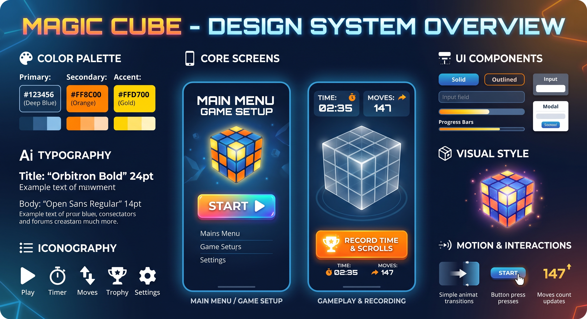
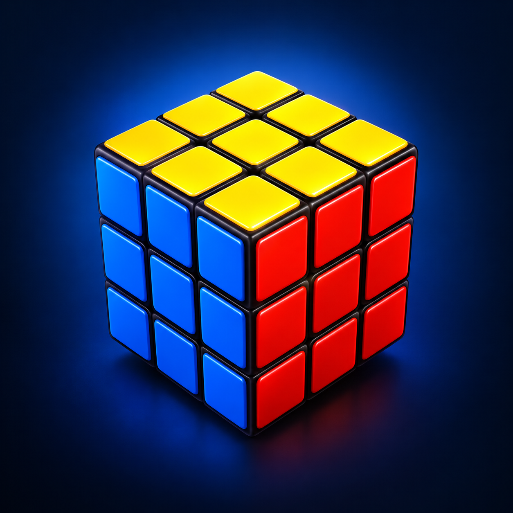

# Magic Cube 🎲✨

<p align="center">
  
</p>

<p align="center">
  
</p>

<p align="center">
  <strong>A high-performance, offline-first 3D Rubik's Cube puzzle game built with Expo, React Native, and Three.js.</strong>
</p>

<p align="center">
  <a href="https://expo.dev"></a>
  <a href="https://reactnative.dev"></a>
  <a href="https://threejs.org"></a>
  <a href="https://www.typescriptlang.org"></a>
  <a href="https://zustand-demo.pmnd.rs"></a>
  
  
</p>

---

## 📖 Overview

**Magic Cube** brings the timeless 3x3 Rubik's Cube into a smooth, interactive 3D mobile experience. Designed for casual players and speedcubing enthusiasts alike, the app delivers fluid slice animations, tactile haptic feedback, WCA-standard scrambles, live solve timing, move counting, and offline local record tracking.

No accounts, no ads, and no network dependencies: just install, scramble, and solve.

---

## ✨ Key Features

- 🧊 **Interactive 3D Scene**:
  - Full 360° orbital navigation with momentum and exponential damping.
  - Natural face turns using 3D raycasting and tangent vector projection with an 18pt gesture threshold.
  - Multi-touch and two-finger touch gestures for rapid cube re-orientation.
  - View presets for White-Top, Yellow-Top, and instant view angle resets.
- 🔀 **WCA-Compliant Scramble Engine**:
  - Random-state 20–25 move scramble sequences using official Singmaster notation (`U`, `D`, `L`, `R`, `F`, `B` + inverses + double turns).
  - Eliminates redundant moves and same-axis cancellations (e.g., `R L R'`).
  - Animated high-speed 70ms shuffle with tap-to-skip capability.
- ⏱️ **Solve Timer & Move Counter**:
  - Centisecond-precision timer that automatically activates upon completing a shuffle or making your first manual turn.
  - Real-time HUD showing elapsed time, move counts, and live Turns Per Second (TPS).
  - Instant solved-state detection across all 54 cube stickers.
- 🏆 **Top Records & Leaderboard**:
  - Saves your top 5 fastest solve records locally using AsyncStorage.
  - Detailed solve summaries tracking time, move count, TPS, and completion dates.
- ⏸️ **Pause & In-Game Controls**:
  - Minimalist HUD: controls automatically center when idle and cleanly hide during active play.
  - Pause modal with Resume, Restart, and Main Menu navigation.
  - Automatically pauses when the application transitions to background.
- 🎨 **Maximalist Cyberpunk Theme**:
  - Custom typography pairing **Orbitron** for digital HUD displays and **Roboto Mono** for scramble notation.
  - Tactile vibrations powered by `expo-haptics`.

---

## 🛠️ Tech Stack & Architecture

| Layer | Technology | Purpose |
|---|---|---|
| **Platform** | Expo SDK 54 + React Native 0.81.5 | Cross-platform runtime and native mobile capabilities |
| **Language** | TypeScript 5.8 (Strict Mode) | Strong typing for cube permutations, coordinates, and store state |
| **3D Engine** | Three.js 0.170 + `@react-three/fiber` 9 + `expo-gl` 16 | Hardware-accelerated WebGL 3D cube rendering |
| **State Machine** | Zustand 5.0 | Centralized store managing cube stickers, animation locks, and timers |
| **Routing** | Expo Router 6.0 | File-based navigation architecture |
| **Gestures** | React Native PanResponder + SceneBridge | Zero-lag touch tracking, 3D raycasting, and screen-space tangent mapping |
| **Persistence** | `@react-native-async-storage/async-storage` | Offline leaderboard and record storage |
| **Testing** | Node.js Test Runner + React Native Testing Library | 178 unit, integration, and UI regression tests |

---

## 📂 Project Structure

```
magic-cube/
├── app/                        # Expo Router entry points and screens
│   ├── _layout.tsx             # Root layout with font loading & safe areas
│   └── index.tsx               # Main game screen container
├── assets/                     # App icons, splash screens, and banner graphics
│   ├── App-icon.png            # 3D Rubik's Cube icon
│   ├── splash-screen.png       # App launch screen
│   └── banner.jpg              # Design system overview banner
├── docs/                       # Architecture specs, design system, and scope
│   ├── design.md               # Color palettes, typography, and UI specs
│   ├── scope/                  # Feature roadmap and milestone tracker
│   └── specs/                  # Technical design specifications (0001 - 0009)
├── src/
│   ├── components/             # Reusable UI and 3D components
│   │   ├── CubeCanvas.tsx      # R3F canvas, SceneBridge raycaster, and PanResponder
│   │   ├── CubeGroup.tsx       # 3D cubie grouping, slerp damping, and slice turns
│   │   ├── Cubie.tsx           # Individual 3D cube piece geometry & face stickers
│   │   ├── GameOverlay.tsx     # HUD timer badge, move counter, and Start/Record controls
│   │   ├── PauseModal.tsx      # In-game pause dialog
│   │   ├── RecordsModal.tsx    # Top 5 solves leaderboard modal
│   │   ├── VictoryCard.tsx     # Solve celebration overlay with stats
│   │   └── ui/                 # Core design system primitives (ThemedButton, Card, Text)
│   ├── logic/                  # Pure math, notation, and game logic
│   │   ├── cameraUtils.ts      # Responsive aspect-ratio camera math
│   │   ├── cubeMoves.ts        # Singmaster permutations, sticker lookups, and tangents
│   │   ├── haptics.ts          # Safe cross-platform tactile feedback
│   │   ├── records.ts          # Score sorting, ranking, and validation
│   │   ├── scramble.ts         # Random scramble generation and cancellation filters
│   │   └── timer.ts            # High-precision time formatting and TPS calculations
│   ├── store/
│   │   └── useCubeStore.ts     # Central Zustand state machine
│   └── theme/                  # Theme tokens (colors, typography, spacing)
├── test/                       # Test suite (178 tests across 11 files)
├── app.json                    # Expo application configuration
├── eas.json                    # Expo Application Services build profiles
└── package.json                # Project dependencies and script declarations
```

---

## 🚀 Getting Started

### Prerequisites

Ensure you have the following installed on your development machine:

- **Node.js**: v18.0.0 or later (Node 20+ recommended)
- **npm** or **yarn** / **pnpm**
- **Expo Go** app on your iOS or Android device (or an emulator/development build)

### Installation

1. **Clone the repository**:
   ```bash
   git clone https://github.com/Afisphbl/Magic-Cube.git
   cd Magic-Cube
   ```

2. **Install dependencies**:
   ```bash
   npm install
   ```

### Running the App

- **Web Browser**:
  ```bash
  npm run web
  ```
- **Android Device / Emulator**:
  ```bash
  npm run android
  ```
- **iOS Simulator**:
  ```bash
  npm run ios
  ```
- **Expo Dev Server**:
  ```bash
  npm start
  ```

---

## 🧪 Testing & Code Quality

The codebase enforces strict test coverage and code quality standards with zero tolerance for broken types or regressions.

```bash
# Run the complete test suite (178 tests)
npm test

# Run TypeScript static type check
npm run typecheck

# Run linter
npm run lint

# Run end-to-end tests (Playwright)
npm run test:e2e
```

---

## 🎮 How to Play

1. **Start a Solve**: Tap the **Start** button in the center of the screen to shuffle the cube with a rapid 20-move animation.
2. **Rotate the Cube (Orbit)**: Drag anywhere in empty space or swipe with two fingers to rotate the entire cube in 3D.
3. **Turn a Face**: Press and swipe along any cubie row or column by more than 18 pixels in the direction you want to turn.
4. **Pause Game**: Tap the pause icon in the top header to freeze the timer and lock interactions.
5. **View Records**: Tap the **Record** button to view your top 5 personal best times and moves.

---

## 📄 License

This project is licensed under the [MIT License](LICENSE).
